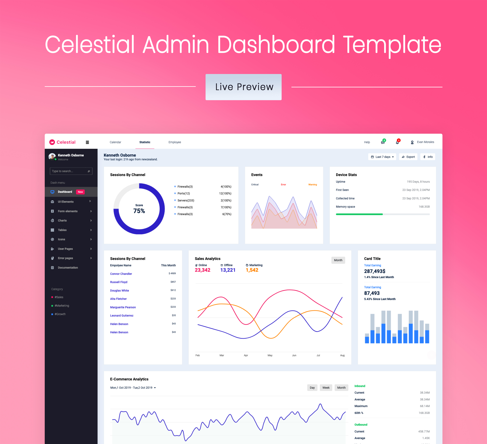

 Celestial - Free Bootstrap Admin Dashboard Template

This is the free version of the Celestial admin dashboard template. Celestial has a very simple layout, specially designed to be easy to use. This admin dashboard template comes with an MIT license, so feel free to use it on all your projects! The premium version contains over 300+ custom handcrafted elements and other features like dark mode, so if you like what you see here, be sure to check out the premium version [here](https://www.bootstrapdash.com/product/celestial-admin-template/)

# Demo 
Click below to check out the live demo.

## Documentation
Click [here](https://www.bootstrapdash.com/demo/celestial-free/docs/documentation.html) to check out the documentation

### Need support?
Report your issues with as many details as you can provide and we’ll try to get back to you as soon as possible

### More from BootstrapDash
Here are some of our most popular templates:

- [StarAdmin Free Bootstrap Admin Template](https://github.com/BootstrapDash/StarAdmin-Free-Bootstrap-Admin-Template)
- [PurpleAdmin Free Admin Template](https://github.com/BootstrapDash/PurpleAdmin-Free-Admin-Template)
- [MajesticAdmin Free Bootstrap Admin Template](https://github.com/BootstrapDash/MajesticAdmin-Free-Bootstrap-Admin-Template)
  
### Like what you see?
Please leave a star on our GitHub repo.
Submit bugs and help us improve Stellar Admin Vue!
Find us on 
- [Twitter](https://twitter.com/bootstrapdash?lang=en) 
- [Facebook](https://www.facebook.com/bootstrapdash/)
- [Instagram](https://www.instagram.com/bootstrapdash/?hl=en)
- [Behance](https://www.behance.net/bootstrapdash)
- [Pinterest](https://www.pinterest.com/bootstrapdash/)
- [Dribbble](https://dribbble.com/bootstrapdash)
- [LinkedIn](https://in.linkedin.com/in/bootstrapdash)

Meticulously built at BootstrapDash. We hope you ❤ Celestial!
### Additional Information

#### Credits:
- Bootstrap 4
- Font Awesome
- jQuery
- Gulp
- Chart.js

#### Browser Support:
Celestial is designed to work flawlessly with all the latest and modern web browsers.

- Chrome (latest)
- FireFox (latest)
- Safari (latest)
- Opera (latest)
- IE10+

#### License Information:

Celestial is released under MIT license. This is a free Bootstrap 4 admin template developed by BootstrapDash. Feel free to download it, use it, share it, and get creative with it.

##### How to use Celestial?

1 - Click the Clone or Download button in GitHub and download as a ZIP file

2 - After the files have been downloaded you will get a folder with all the required files.

3 - You can install all the dependencies in the template by running the command npm install. All the required files are in the node modules. If you didn't run with admin authorities, you will see errors

4 - Find the file named index.html, check what all components you need. Open the file in a text editor and you can start editing.

5 - Now that your project has now kick-started, all you need to do now is to code, code, and code to your heart's content.

#### How to Contribute?
We love your contributions and we welcome them wholeheartedly. To contribute make sure you have Node.js and npm installed. Now run the command gulp --version. If the command returns with the Gulp version number, it means you have Gulp installed. If not you need to run the command npm install --global gulp-cli to install Gulp.

After Gulp has been installed, follow the steps below to contribute.

1 - Fork and clone the repo.

2 - Run the command npm install to install all the dependencies.

3 - Enter the command gulp serve. This will open Celestial in your default browser.

4 - Make your contribution.

5 - Submit a pull request.

#### Go Premium!

Do you need a template with more features and functionalities? Get more with our collection of the premium template with more plugins, eye-catching animations, UI components, and sample pages all fitting together with a high-quality design. Visit [https://www.bootstrapdash.com](https://www.bootstrapdash.com) for more admin templates.